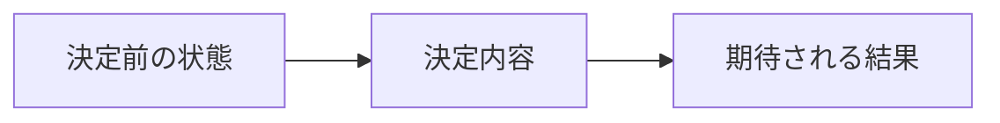

# ADR-000: {タイトル}

<!-- ツール名: {ツール名} -->

## ステータス

{提案中 / 承認済 / 廃止 / 代替済}

> N/A（テンプレート）

## コンテキスト

{この決定が必要になった背景・課題を記述}

## 決定

{何をどのように決定したかを記述}

## 理由

{なぜこの決定を選んだかを記述。検討した代替案とその比較も含める}

### 検討した選択肢

| 選択肢 | メリット | デメリット |
|---|---|---|
| {選択肢A}（採用） | {メリット} | {デメリット} |
| {選択肢B} | {メリット} | {デメリット} |
| {選択肢C} | {メリット} | {デメリット} |

## 結果

{この決定によって生じる影響・結果を記述}

