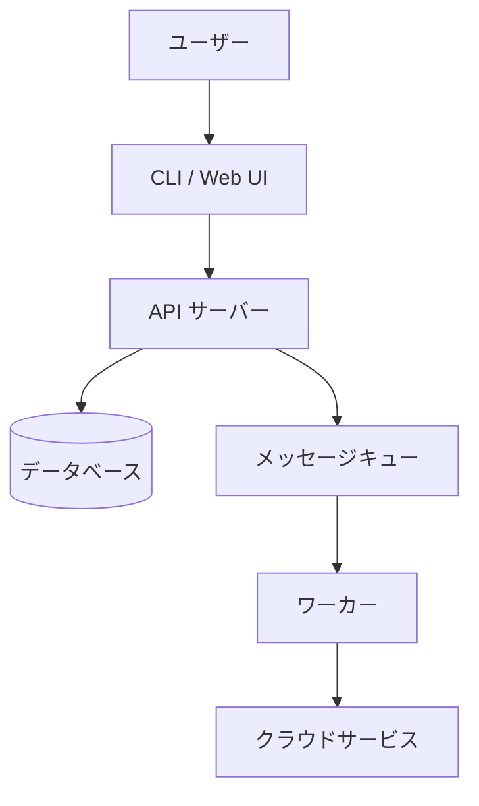
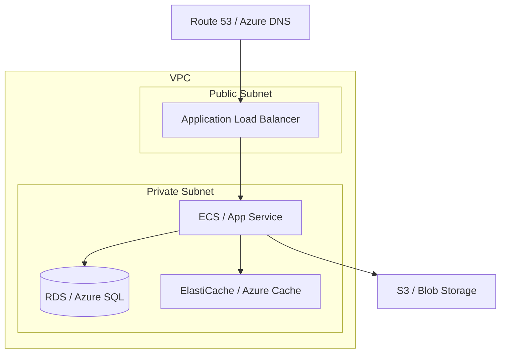
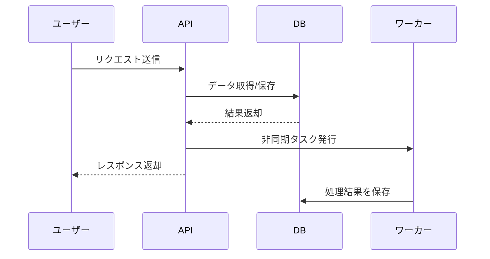

# アーキテクチャ

<!-- ツール名: {ツール名} -->

## システム構成図

## インフラ構成（AWS / Azure）

## コンポーネント説明

| コンポーネント | 役割 | 技術 |
|---|---|---|
| {コンポーネント1} | {役割の説明} | {使用技術} |
| {コンポーネント2} | {役割の説明} | {使用技術} |
| {コンポーネント3} | {役割の説明} | {使用技術} |
| {コンポーネント4} | {役割の説明} | {使用技術} |

## データフロー

