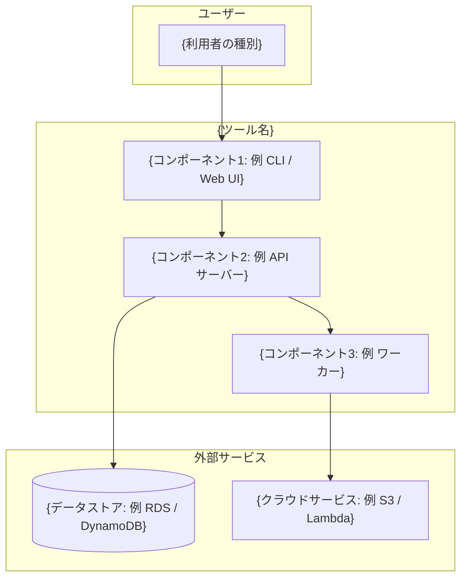
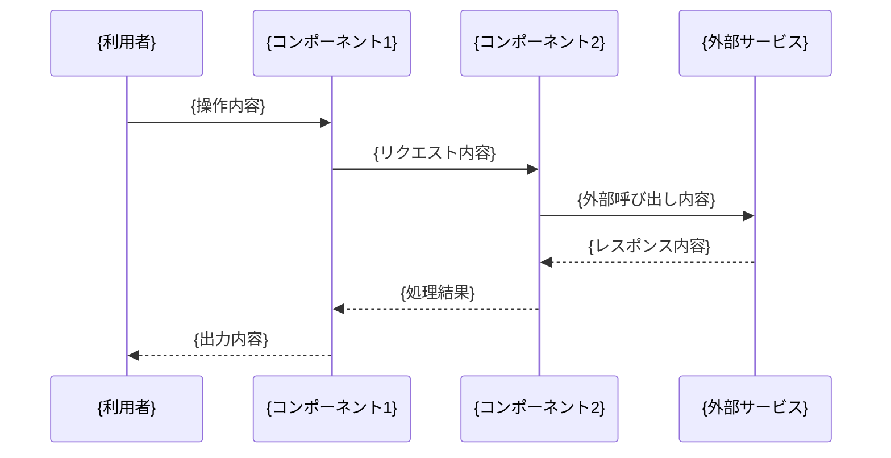
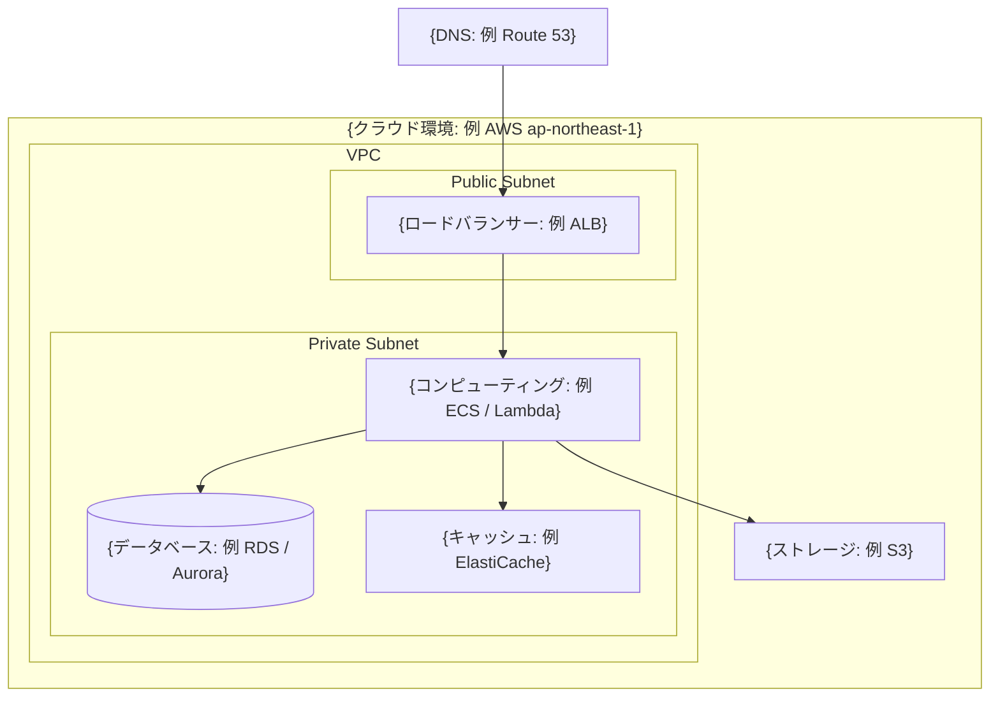

# アーキテクチャ

<!-- ガイド: このドキュメントではツール全体の構成図・処理フロー・コンポーネント間の依存関係を記載します。図は Mermaid 記法で記述し、GitHub 上でそのままレンダリングされるようにしてください。 -->

## 全体構成図

<!-- ガイド: ツールを構成する主要コンポーネントとその関係を Mermaid の graph で描いてください。外部サービスやユーザーとの境界が分かるようにすると読みやすくなります。 -->

## 処理フロー

<!-- ガイド: 代表的なユースケースにおけるデータの流れを sequence diagram で描いてください。複数のフローがある場合はユースケースごとにサブセクションを分けてください。 -->

## AWS / Azure サービス構成

<!-- ガイド: 使用しているクラウドサービスとネットワーク構成を記載してください。VPC / サブネット / セキュリティグループなどの境界が分かると、インフラ担当者が構成を把握しやすくなります。 -->

## コンポーネント一覧と依存関係

<!-- ガイド: 各コンポーネントの役割と、どのコンポーネントに依存しているかを表で整理してください。 -->

| コンポーネント | 役割 | 依存先 | 技術 |
|---|---|---|---|
| {コンポーネント1} | {役割の説明} | {依存するコンポーネント名} | {使用技術} |
| {コンポーネント2} | {役割の説明} | {依存するコンポーネント名} | {使用技術} |
| {コンポーネント3} | {役割の説明} | {依存するコンポーネント名} | {使用技術} |
